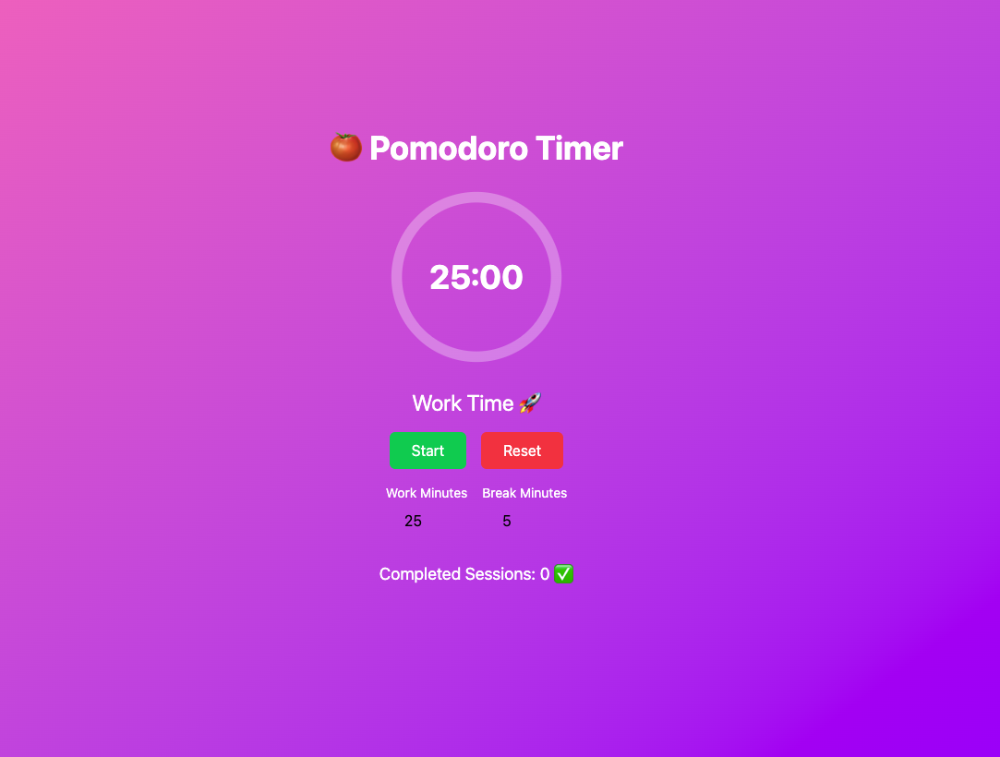

# ⏳ Pomodoro Timer App  

A **simple and customizable Pomodoro Timer** built with **React, TypeScript, and Tailwind CSS**. This app helps you stay productive by following the **Pomodoro Technique**, which consists of **focused work sessions** followed by **short breaks**.  

## 🚀 Features  

- ⏰ **Start, Pause, and Reset** the timer  
- 🔄 **Customizable Work and Break Durations**  
- 🔊 **Notification Sound** when the timer ends  
- 📊 **Tracks Completed Work Sessions**  
- 🎨 **Modern UI with Tailwind CSS**  

## 🖼️ Screenshot  

  

## 🛠️ Tech Stack  

- **React** (Functional Components & Hooks)  
- **TypeScript** (For better type safety)  
- **Tailwind CSS** (For styling)  

## 📦 Installation  

1. **Clone the repository**  
   ```sh
   git clone https://github.com/your-username/pomodoro-timer.git
   cd pomodoro-timer
